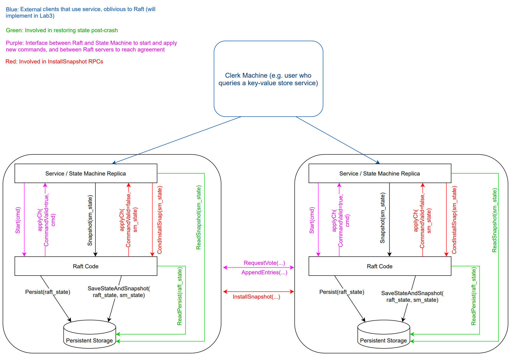

# 总体概览
lab3 的内容是要在 lab2 的基础上实现一个高可用的 KV 存储服务，算是要将 raft 真正的用起来。

有关此 lab 的实现，raft 作者博士论文的第 6.3 小节——实现线性化语义已经做了很详细的介绍，强烈建议在实现之前进行阅读。此外也建议参考 dragonboat 作者对此的讨论。

以下内容都会假定读者已看过以上两个资料。

相关 RPC 实现如下图：


**对于lab3的概览，我们可以采用官方的一张图来了解大概**



<br/>
-  **KVServer(server.go) 是 State Machine**， 每个KVServer对应一个 Raft peer node, KVServer之间只通过Raft 服务来达成共识，不会直接交互。 根据 paper Client interaction 的说明， KVServer 应该知道请求来自哪个具体的客户端，且保存每个客户端的请求状态。即我们需要给每个客户端一个唯一的ID， 且其同一个请求需要有唯一的 Seq , 两者结合来确定一个唯一性的请求，毕竟由于网络问题和客户端的重发机制，可能会导致重复执行一个命令。
- 客户端的ID用 nrand（）生成即可，测试最多7个客户端，不会重复，生产环境下会用 IP:PORT 的方法去定位具体的 Client . 每个 Clinet 维护一个 SeqId， 来提供每一次请求的识别号.
<br/>
## 一次请求的流程

可以先参考我画的这个图


1. Server（**Leader 这里 Client 可能发送多个请求去不同的 Server 来找到 leader**）收到 Client 的 Request
2. 通过raft.Start() 提交 Op 给 raft 层 ,同时开启一个 Wait Channel 接受 Reply 。 
3. **Raft 共识达成后，Raft 会将该 Op 塞入 Server 专门的 ApplyCh 来告诉 Server 可以执行该 Op 了, 每个Server会在单独的线程 ApplyLoop 中等待不断到来的 ApplyCh 中的 Op.**
4. 执行这个 Op ( GET 全部执行，重复的 PUT, APPEND 不执行)
5. Apply Loop 根据 Op 中的信息将执行结果返回给 Wait Channel , 注意，只有 Leader 才能处理客户端的请求
6. 返回执行结果给 Client


## Client
前面提到要用 (clientId,commandId) 来唯一的标识一个客户端。

在目前的实现中，客户端的 clientId 生成方式较为简陋，基本上是从 [0,1 << 62] 的区间中随机生成数来实现的，当然，由于 clientId 只需要保证唯一即可，不需要保证递增，使用更简单的 uuid 其实也可以。不过由于 go 的标准库并无内置的 uuid 实现，且 6.824 又要求不能更改 go mod 文件引入新的包，所以这里就直接用它默认的 nrand() 函数了。

一个 client 可以通过为其处理的每条命令递增 seqId 的方式来确保不同的命令一定有不同的 seqId，当然，同一条命令的 seqId 在没有处理完毕之前，即明确收到服务端的写入成功或失败之前是不能改变的。

Client 代码：

```go

type Clerk struct {
	servers []*labrpc.ClientEnd
	// You will have to modify this struct.
	leaderId int
	seqId    int64
	clientId int64
}

func MakeClerk(servers []*labrpc.ClientEnd) *Clerk {
	ck := new(Clerk)
	ck.servers = servers
	// You'll have to add code here.
	ck.leaderId = 0
	ck.clientId = nrand()
	ck.seqId = 0
	return ck
}

func (ck *Clerk) sendCmd(key string, value string, OpType OPType) string {
	ck.seqId += 1
	args := CmdArgs{
		SeqId:    ck.seqId,
		ClientId: ck.clientId,
		Key:      key,
		Value:    value,
		OpType:   OpType,
	}

	t0 := time.Now()
	for time.Since(t0).Seconds() < 10 {
		reply := CmdReply{}

		ok := ck.servers[ck.leaderId].Call("KVServer.Command", &args, &reply)

		if !ok {
			ck.leaderId = (ck.leaderId + 1) % len(ck.servers)
			time.Sleep(retry_timeout)
			continue
		}

		if reply.Err == OK {
			return reply.Value
		} else if reply.Err == ErrNoKey {
			return ""
		}

		ck.leaderId = (ck.leaderId + 1) % len(ck.servers)
		time.Sleep(retry_timeout)
	}
	return ""
}

func (ck *Clerk) Get(key string) string {
	return ck.sendCmd(key, "", OpGet)
}

func (ck *Clerk) Put(key string, value string) {
	ck.sendCmd(key, value, OpPut)
}

func (ck *Clerk) Append(key string, value string) {
	ck.sendCmd(key, value, OpAppend)
}

```

# Server

Server的结构：
```go
type KVServer struct {
	mu      sync.Mutex
	me      int
	rf      *raft.Raft
	applyCh chan raft.ApplyMsg
	dead    int32 // set by Kill()

	maxraftstate int // maxraftstate表示允许的持久Raft状态的最大字节大小

	// Your definitions here.
	KvMap          *KV
	cmdRespChans   map[IndexAndTerm]chan OpResp
	LastCmdContext map[int64]OpContext
	lastApplied    int
	lastSnapshot   int
}

type OpContext struct {
	SeqId int64
	Reply OpResp
}
func StartKVServer(servers []*labrpc.ClientEnd, me int, persister *raft.Persister, maxraftstate int) *KVServer {
	// call labgob.Register on structures you want
	// Go's RPC library to marshall/unmarshall.
	labgob.Register(Op{})

	kv := new(KVServer)
	kv.me = me
	kv.maxraftstate = maxraftstate

	// You may need initialization code here.

	kv.applyCh = make(chan raft.ApplyMsg, 5)
	kv.rf = raft.Make(servers, me, persister, kv.applyCh)

	// You may need initialization code here.
	kv.KvMap = NewKV()
	kv.cmdRespChans = make(map[IndexAndTerm]chan OpResp)
	kv.LastCmdContext = make(map[int64]OpContext)
	kv.lastApplied = 0
	kv.lastSnapshot = 0

	// load data from persister
	kv.setSnapshot(persister.ReadSnapshot())

	// long-time goroutines
	go kv.applier()
	go kv.snapshoter()

	return kv
}
```
对于 raft 的日志序列，状态机需要按序 apply 才能保证不同节点上数据的一致性。因此，在实现中一定得有一个单独的 apply 线程去顺序地 apply 日志到状态机(Server)中去。

对于客户端的请求，rpc 框架也会生成一个线程去处理逻辑。因此，需要考虑清楚这些线程之间的通信关系。

为此，就像前面我所展示的一次请求的过程，我的实现是对于每一个命令，先将该命令做成日志放入 raft 层去同步的同时注册一个 Wait channel 去阻塞等待 Reply ，接着 apply 线程监控 applyCh，在得到 raft 层已经 commit 的日志后，apply 线程首先将其 apply 到状态机中，接着将状态机执行的结果 push 到 Wait channel 中，然后回复结果给客户端。

下面来看看 Server 开放给 Client 的 RPC 代码和 Apply 线程的代码

```go
func (kv *KVServer) Command(args *CmdArgs, reply *CmdReply) {
	kv.mu.Lock()
    //去重，如果非幂等请求重复了，则返回上一次的回答
	if args.OpType != OpGet && kv.isDuplicate(args.ClientId, args.SeqId) {
		context := kv.LastCmdContext[args.ClientId]
		reply.Value, reply.Err = context.Reply.Value, context.Reply.Err
		kv.mu.Unlock()
		return
	}
	kv.mu.Unlock()

	cmd := Op{
		ClientId: args.ClientId,
		SeqId:    args.SeqId,
		OpType:   args.OpType,
		Key:      args.Key,
		Value:    args.Value,
	}
    //若不是 leader 的话该 cmd 不会传给 raft 层的，start的内部实现
	index, term, is_leader := kv.rf.Start(cmd)
	if !is_leader {
		reply.Value, reply.Err = "", ErrWrongLeader
		return
	}
	kv.mu.Lock()
	it := IndexAndTerm{index, term}
    //创建 Wait Channel 等待回答
	ch := make(chan OpResp, 1)
    //根据索引放起来，以便 Server 的 ApplyLoop 执行完后，能够将 Reply 正确的塞入 Wait Channel
	kv.cmdRespChans[it] = ch
	kv.mu.Unlock()

	defer func() {
        //结束完记得删除 Wait Channel 清理空间
		kv.mu.Lock()
		delete(kv.cmdRespChans, it)
		kv.mu.Unlock()
		close(ch)
	}()
    //若超时了，就告诉客户端该情况
	t := time.NewTimer(cmd_timeout)
	defer t.Stop()

	for {
		kv.mu.Lock()
		select {
            //返回结果
		case resp := <-ch:
			reply.Value, reply.Err = resp.Value, resp.Err
			kv.mu.Unlock()
			return
            //超时，让客户端一会再试
		case <-t.C:
			reply.Value, reply.Err = "", ErrTimeout
			kv.mu.Unlock()
			return
		default:
			kv.mu.Unlock()
			time.Sleep(gap_time)
		}
	}
}

func (kv *KVServer) applier() {
	for !kv.killed() {
		select {
		case msg := <-kv.applyCh:
			//是快照
			if msg.SnapshotValid {
				kv.mu.Lock()
				if kv.rf.CondInstallSnapshot(msg.SnapshotTerm, msg.SnapshotIndex, msg.Snapshot) {
					kv.setSnapshot(msg.Snapshot)
					kv.lastApplied = msg.SnapshotIndex
				}
				kv.mu.Unlock()
			} else if msg.CommandValid {
				kv.mu.Lock()
				//不执行过期消息
				if msg.CommandIndex <= kv.lastApplied {
					kv.mu.Unlock()
					continue
				}
				kv.lastApplied = msg.CommandIndex

				var resp OpResp
				cmd := msg.Command.(Op)
				//重复直接返回缓存
				if cmd.OpType != OpGet && kv.isDuplicate(cmd.ClientId, cmd.SeqId) {
					context := kv.LastCmdContext[cmd.ClientId]
					resp = context.Reply
				} else {
					//不重复则执行命令
					resp.Value, resp.Err = kv.Opt(cmd)
					kv.LastCmdContext[cmd.ClientId] = OpContext{
						SeqId: cmd.SeqId,
						Reply: resp,
					}
				}
				//不是 leader 的话不能给客户端应答
				term, isLeader := kv.rf.GetState()

				if !isLeader || term != msg.CommandTerm {
					kv.mu.Unlock()
					continue
				}
				//返回应答
				it := IndexAndTerm{msg.CommandIndex, term}
				ch, ok := kv.cmdRespChans[it]
				if ok {
					//等管道 10 毫秒，能塞最好 不行让客户端下次再试，毕竟已经缓存了回答
					select {
					case ch <- resp:
					case <-time.After(10 * time.Millisecond):
					}
				}

				kv.mu.Unlock()
			} else {
				// 无效命令
			}
		default:
			//不许 Sleep ！否则可能会导致 RaftStateSize 过大通不过测试 ，主要就是 lastApplied 不能及时变化，导致不能进行快照，压缩日志
			//time.Sleep(gap_time)
		}
	}
}
```

需要注意的有以下几点：

- 提交日志时不持 kvserver 的锁：当有多个客户端并发向 kvserver 提交日志时，kvserver 需要将其下推到 raft 层去做共识。一方面，raft 层的 Start() 函数已经能够保证并发时的正确性；另一方面，kvserver 在生成 snapshot 时需要持锁，此时没有必要去阻塞 raft 层继续同步日志。综合这两个原因，将请求下推到 raft 层做共识时，最好不要加 kvserver 的锁，这一定程度上能提升性能。
- 客户端发起 RPC 阻塞等待结果时超时返回：为了避免客户端被长时间阻塞，其在交给 leader 处理后阻塞时需要考虑超时，一旦超时就返回客户端选择是否重试。这里有很多种情况，比如你正在 apply log 可是你突然不是 leader 了，如果这些 Wait Channel 就一直阻塞着，为了防止这种情况发送，需要在服务端判定，若超时则返回 ERR_TIMEOUT,让客户端停止阻塞。
- apply 日志时需要防止状态机回退：从 applyCh 中拿到一个日志后需要保证其 index 大于等于 lastApplied 才可以应用到状态机中。
- 对非读请求去重：对于写请求，由于其会改变系统状态，因此在执行到状态机之前需要去重，仅对不重复的日志进行 apply 并记录执行结果，保证其仅被执行一次。对于读请求，由于其不影响系统状态，所以直接去状态机执行即可，当然，其结果也不需要再记录到去重的数据结构中。
- 被 raft 层同步前尝试去重：对于写请求，在未调用 Start 函数即未被 raft 层同步时可以先进行一次检验，如果重复则可以直接返回上次执行的结果而不需要利用 raft 层进行同步，因为同步完成后的结果也是一样。当然，即使该写请求重复，但此时去重表中可能暂还不能判断其是否重复，此时便让其在 raft 层进行同步并在 apply 时去重即可。

## 关于Snapshot
官方在创建 Server 时会传入 maxraftstate，

如果maxraftstate为-1，则快照功能关闭。
若不为 1，则 kv.rf.RaftPersistSize() 的小于 8 * maxraftstate 才能通过测试用例
这在 test_test.go 的 371 行可以看见

对此，我们可以另起一个线程，每隔一段时间 snapshot 一次，这里贴出该线程的代码。

```go
func (kv *KVServer) snapshoter() {
	for !kv.killed() {
		kv.mu.Lock()
		if kv.isNeedSnapshot() && kv.lastApplied > kv.lastSnapshot {
			kv.doSnapshot(kv.lastApplied)
			kv.lastSnapshot = kv.lastApplied
		}
		kv.mu.Unlock()
		time.Sleep(snapshot_gap_time)
	}
}
func (kv *KVServer) isNeedSnapshot() bool {
	//如果maxraftstate为-1，则快照功能关闭。
	if kv.maxraftstate != -1 && kv.rf.RaftPersistSize() > kv.maxraftstate {
		// if kv.rf.RaftPersistSize() > 5000 {
		// 	fmt.Printf("S%v need SnapShot , now RaftStateSize is:%v\n", kv.me, kv.rf.RaftPersistSize())
		// }
		return true
	}
	return false
}
func (kv *KVServer) doSnapshot(commandIndex int) {
	DPrintf("S%d doSnapshot", kv.me)
	w := new(bytes.Buffer)
	e := labgob.NewEncoder(w)
	if e.Encode(*kv.KvMap) != nil ||
		e.Encode(kv.LastCmdContext) != nil {
		panic("server doSnapshot encode error")
	}
	kv.rf.Snapshot(commandIndex, w.Bytes())
}
```
这里认为 KV 层需要进行快照的有：LastCmdContext（防止重复请求的情况发送），KvMap（数据库的数据），这里只是讲 KV 层，Raft层还有快照呢，然后 KV 层会将该层的快照发给 Raft 层，接下来的就是 lab2 里的内容了。

**对于收到快照请求，也是将收到的快照先交给 Raft 层，Raft 应用了属于自己的状态后，再应用 KV 层的状态。**
