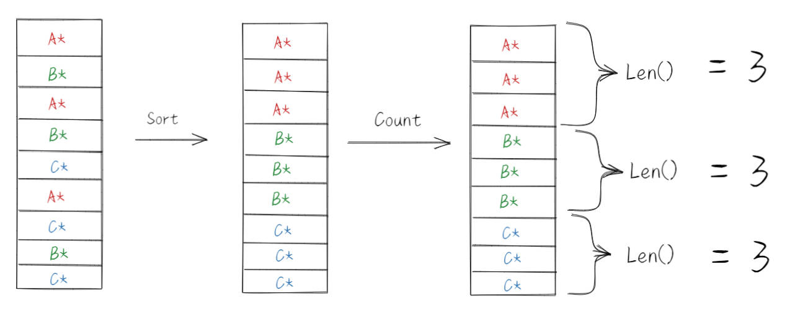
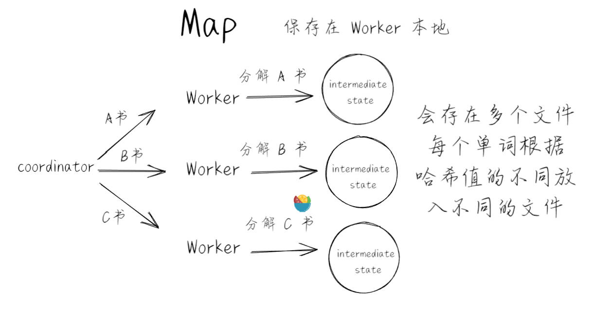
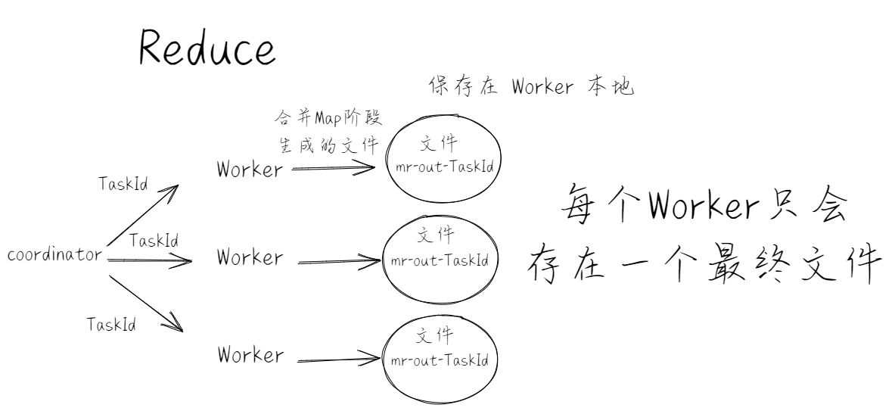

# lab1概览
6.824所有Lab都使用 Go 为主要编程语言，若你不熟悉，可以快速看看Golang官方入门。当然，要让代码优雅高效，充分学习Go语言还是非常有必要的。

在完成这个实验前，我们肯定做到以下几点
1. 熟悉一下 Go 语言
2. MapReduce 论文阅读
3. [lab1 note 阅读](http://nil.csail.mit.edu/6.824/2021/labs/lab-mr.html)

实验代码可以在 https://github.com/wakk3107/wakk_6.824 处找到（2021-spring）。

该实验要求我们实现一个和 [MapReduce论文](https://developer.aliyun.com/article/31829) 类似的机制，也就是数单词个数 Word Count。实现分布式 mr ,一个 coordinator ,一个 worker（启动多个）,在这次实验都在一个机器上运行。worker 通过 rpc 和 coordinator 交互。worker请求任务,进行运算,写出结果到文件。coordinator 需要关心worker的任务是否完成，在超时情况下将任务重新分配给别的  worker 。

用于测试的文件在 `src/main` 目录下，以 `pg-*.txt` 形式命名。每个`pg-*.txt` 文件都是一本电子书，非常长。我们的任务是统计出所有电子书中出现过的单词，以及它们的出现次数。
在src/main下运行 `./test-mr.sh` 便可进行测试

# 关于非分布式实现
数单词这个任务的非分布式实现在 `src/main/mrsequential.go` 中

将所有文章中的单词分出，保存到一个类似数组的结构中。将这些单词排序，从而相同单词在数组中连续地出现在一起。排序完成后，遍历这个数组，由于相同的单词相邻地出现，统计单词个数就很简单了。



可以像 lab1 note 中讲的那样运行一下看什么效果
```bash
cd src/main
go build -buildmode=plugin ../mrapps/wc.go
go run mrsequential.go wc.so pg*.txt
```
输出文件在 `src/main/mr-out-0` ，文件中每一行标明了单词和出现次数。

# 分布式实现
测试程序运行一个 `src/main/mrcoordinator.go`,多个 `src/main/mrworker.go` 并在运行过程中进行一些下线操作或是其他的，最后通过验证你的文件输出来判断是否 pass。

查看测试脚本 `test-mr.sh` ，可以看到合并每个输出 `mr-out*` 的指令如下，将每个输出文件的每一行按行首单词排序，输出到最终文件 `mr-wc-all` 中。
```
sort mr-out* | grep . > mr-wc-all
```
此步类似于从多个不同台机器汇总输出结果为一个文件

在我代码中的实现就是类似于以下流程：

首先是 Map阶段



图中是主动给任务，方便理解，代码中是 Worker 通过 Rpc 向 Coordinator 要的。

接着是 Reduce 阶段



最后 test 程序便会整合所有 Worker 生成结果，来进行 pass 判断。

下面提供一下我的部分代码：

# Worker
```go
func Worker(mapf func(string, string) []KeyValue,
	reducef func(string, []string) string) {
	// Your worker implementation here.
	for {
		args := GetTaskArgs{}
		reply := GetTaskReply{}
		ok := CallGetTask(&args, &reply)
		//没任务了就关机
		if !ok || reply.Type == STOP {
			break
		}

		// handle map fynction
		switch reply.Type {
		case MAP:
			if len(reply.Filenames) < 1 {
				log.Fatalf("don't have filename")
			}
			DoMAP(reply.Filenames[0], reply.TaskId, reply.NReduce, mapf)
			// map complete, send msg to master
			finish_args := FinishTaskArgs{
				Type:   MAP,
				TaskId: reply.TaskId,
			}
			finish_reply := FinishTaskReply{}
			CallFinishTask(&finish_args, &finish_reply)
		case REDUCE:
			if len(reply.Filenames) < 1 {
				log.Fatalf("don't have filenames")
			}
			DoReduce(reply.Filenames, reply.TaskId, reducef)
			// reduce complete, send msg to master
			finish_args := FinishTaskArgs{
				Type:   REDUCE,
				TaskId: reply.TaskId,
			}
			finish_reply := FinishTaskReply{}
			CallFinishTask(&finish_args, &finish_reply)
			// time.Sleep(time.Second)
		case WAIT:
			time.Sleep(time.Second)
		default:
			time.Sleep(time.Second)
		}
	}
}
```

# Coordinator
```go
func MakeCoordinator(files []string, nReduce int) *Coordinator {
	c := Coordinator{}

	// Your code here.
	c.Init(files, nReduce)
	//等待 worker 来要任务
	c.server()
	return &c
}
func (c *Coordinator) Init(files []string, nReduce int) {
	c.mu.Lock()
	defer c.mu.Unlock()

	// 初始化 map 任务
	tasks := make([]Task, len(files))
	for i, file := range files {
		tasks[i].taskId = i
		tasks[i].filenames = []string{file}
		tasks[i].status = idle
	}
	// init coordinator
	c.tasks = tasks
	c.nReduce = nReduce
	c.nMap = len(files)
	c.status = MAP_PHASE
}

func (c *Coordinator) GetTask(args *GetTaskArgs, reply *GetTaskReply) error {
	c.mu.Lock()
	defer c.mu.Unlock()
	//检查一下当前阶段任务是否全都完成，若都已完成，切换到下个阶段继续分配
	finish_flag := c.IsAllFinish()
	if finish_flag {
		c.NextPhase()
	}
	for i := 0; i < len(c.tasks); i++ {
		//有闲置任务则分配
		if c.tasks[i].status == idle {
			log.Printf("send task %d to worker\n", i)
			reply.Err = SuccessCode
			reply.TaskId = i
			reply.Filenames = c.tasks[i].filenames
			if c.status == MAP_PHASE {
				reply.Type = MAP
				reply.NReduce = c.nReduce
			} else if c.status == REDUCE_PHASE {
				reply.NReduce = 0
				reply.Type = REDUCE
			} else {
				log.Fatal("unexpected status")
			}
			//初始化开始时间，若超时，则重新分配任务
			c.tasks[i].startTime = time.Now()
			c.tasks[i].status = in_progress
			return nil

		} else if c.tasks[i].status == in_progress {
			//无闲置任务则分配超时任务
			curr := time.Now()
			if curr.Sub(c.tasks[i].startTime) > time.Second*10 {
				log.Printf("resend task %d to worker\n", i)
				reply.Err = SuccessCode
				reply.TaskId = i
				reply.Filenames = c.tasks[i].filenames
				if c.status == MAP_PHASE {
					reply.Type = MAP
					reply.NReduce = c.nReduce
				} else if c.status == REDUCE_PHASE {
					reply.NReduce = 0
					reply.Type = REDUCE
				} else {
					log.Fatal("unexpected status")
				}
				c.tasks[i].startTime = time.Now()
				return nil
			}
		}
	}
    //无可分配的任务
	reply.Err = SuccessCode
	reply.Type = WAIT
	return nil
}
```

# 最终
写好代码之后，运行测试脚本 `test-mr.sh` ，应通过所有测试。