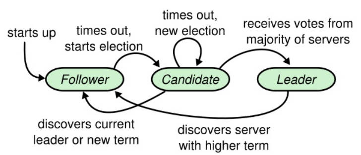

# 总体概览
lab2 的内容是要实现一个除了节点变更功能外的 raft 算法，还是比较有趣的。
它被划分成了Lab2A、Lab2B、Lab2C和Lab2D四个子任务：

1. Lab2A：实现 leader election、heartbeat。
2. Lab2B：实现 Log replication。
3. Lab2C：实现 state persistent。
4. Lab2D：实现 SnapShot


有关 go 实现 raft 的种种坑，可以首先参考 6.824 课程对[locking](https://pdos.csail.mit.edu/6.824/labs/raft-locking.txt) 和 [structure](https://pdos.csail.mit.edu/6.824/labs/raft-structure.txt) 的描述，然后再参考 6.824 TA 的 [guidance](https://thesquareplanet.com/blog/students-guide-to-raft/) 。写之前一定要看看这三篇博客，否则很容易被 bug 包围。

实现Raft的时候基本就盯着Figure2的图片即可：


## 关于 LogIndex
raft 关于一致性最重要的就是 peers 之间各种 Index 的同步。但需要注意的一点是：**logEntry 的 Index 是从 1 开始的**，而不同与log[]的数组下标。在完成 D Snapshot时，需要在数据中截断Index小于SnapShotIndex的Entry，而只保留Index大于的Entry在log[]数组中，因此，我们要正确区分 EntryIndex (包括figure2中提及的所有Index)和 ArrayIndex (用作下表去取log[]中的Entry）。因此关于 Log数组中下标为0的位置，我拿来作为个 dummy node,用于lab4D中的 lastSnapShotIndex 和 lastSnapShotTerm，这样后续的代码会有一定的简便性。


下面会简单介绍我实现的 raft。


# Lab2A

- tester 要求 leader 一秒钟内不要发送超过十次心跳
- tester 要求 raft 在老 leader 挂掉5秒内选出 leader ，如果出现瓜分选票，领导人选举可能需要多轮投票（如果数据包丢失或候选人不幸选择了相同的随机退避时间，则可能会发生这种情况）。必须选择足够短的选举超时（以及心跳间隔），即使需要多轮投票，选举也很可能在不到五秒钟内完成。
- 5.2章说选举超时时间在150到300毫秒之间。只有当领导者发送心跳的频率远远超过每150毫秒一次时，这样的范围才有意义。由于测试仪将您的心跳限制为每秒10次，因此您必须使用大于纸张的150到300毫秒的选举超时，但不能太大，因为这样您可能无法在5秒钟内选举领导人
- 需要编写定期或延迟后执行操作的代码。最简单的方法是创建一个goroutine，其中包含一个调用时间的循环。sleep（）；（请参见Make（）为此创建的 ticker（）goroutine）。不要用time.Timer或者time.ticker（官方说的，time.ticker比较难用什么的）
- rpc只发送首字母是大写的struct，子struct也要大写
- 先把代码结构看懂，在 raft 的 make 方法里面起了一个守护线程 ticker ，在 ticker 里面随便打印下东西然后运行go test -run 2A 感受感受三个raft分别在打印自己 ticker 里面的东西。(别在make方法构造里面尝试选举，我一开始犯了这个错误)，也可以不采用 ticker ，自己起一个线程。
## Raft 

```go
type Raft struct {
	mu        sync.Mutex          // Lock to protect shared access to this peer's state
	peers     []*labrpc.ClientEnd // RPC end points of all peers
	persister *Persister          // Object to hold this peer's persisted state
	me        int                 // this peer's index into peers[]
	dead      int32               // set by Kill()

	// Your data here (2A, 2B, 2C).
	// Look at the paper's Figure 2 for a description of what
	// state a Raft server must maintain.

	// 所有服务器，持久化状态（lab-2A不要求持久化）
	currentTerm int         // 见过的最大任期
	votedFor    int         // 记录在currentTerm任期投票给谁了
	log         []*LogEntry // 操作日志

	// 所有服务器，易失状态
	commitIndex int // 已知的最大已提交索引
	lastApplied int // 当前应用到状态机的索引

	// 仅Leader，易失状态（成为leader时重置）
	nextIndex  []int //	每个follower的log同步起点索引（初始为leader log的最后一项）
	matchIndex []int // 每个follower的log同步进度（初始为0），和nextIndex强关联

	// 所有服务器，选举相关状态
	role              string    // 身份
	leaderId          int       // leader的id
	lastActiveTime    time.Time // 上次活跃时间（刷新时机：收到leader心跳、给其他candidates投票、请求其他节点投票）
	lastBroadcastTime time.Time // 作为leader，上次的广播时间
}
// 日志项
type LogEntry struct {
	Command interface{}
	Term    int
}
type RequestVoteArgs struct {
	// Your data here (2A, 2B).
	Term         int
	CandidateId  int
	LastLogIndex int
	LastLogTerm  int
}


type RequestVoteReply struct {
	// Your data here (2A).
	Term        int
	VoteGranted bool
}

type AppendEntriesArgs struct {
	Term         int
	LeaderId     int
	PrevLogIndex int
	PrevLogTerm  int
	Entries      []*LogEntry
	LeaderCommit int
}

type AppendEntriesReply struct {
	Term    int
	Success bool
}
```
## Make 函数
```go
func Make(peers []*labrpc.ClientEnd, me int,
	persister *Persister, applyCh chan ApplyMsg) *Raft {
	rf := &Raft{}
    //其他节点
	rf.peers = peers
    //用于lab2C
	rf.persister = persister
	rf.me = me

	// Your initialization code here (2A, 2B, 2C).
	rf.role = ROLE_FOLLOWER
	rf.leaderId = -1
	rf.votedFor = -1
	rf.lastActiveTime = time.Now()

	// initialize from state persisted before a crash
	rf.readPersist(persister.ReadRaftState())

	// election逻辑
	go rf.electionLoop()
	// leader逻辑 labA有关persist的都可以不用
	go rf.appendEntriesLoop()

	DPrintf("Raftnode[%d]启动", me)

	return rf
}
```

## 关于选举


首先raft三种状态：follower,candidate,leader。按照上面的状态转换，妥妥实现选举。

### leader选举细节

raft（Follower） 用一个线程来通过判断上次 Leader 活跃时间（是否对我发起心跳）监测 Leader 是否下线。当服务器启动时会初始化为 follower。只要它们能够收到来自 leader 或者candidate 的有效 RPC，服务器会一直保持 follower 的状态。leader 会向所有 follower 周期性发送心跳（heartbeat，不带有任何日志条目的 AppendEntries RPC）来保证leader地位。如果一个追随者在一个周期内没有收到心跳信息，就叫做选举超时（election timeout）,然后它就会假定没有可用的领导人并且开始一次选举来选出一个新的 leader。 为了开始选举，follower 会自增它的当前任期并且转换状态为 candidate ，给自己投票并且给集群中的其他服务器发送 RequestVote RPC。一个候选人会一直处于该状态，直到下列两种情形之一发生：

1. 赢得了选举；
2. 另一台服务器赢得了选举；

### 如何赢得选举呢？ 

一个 candidate 在选举期间内收到了来自集群中大多数服务器的投票就会赢得选举。**然后它会马上像其他服务器发送心跳信息来建立自己的领导地位并且阻止新的选举**。 
### 一个 Candidate 宣称胜选 

当一个 candidate 等待别人的选票时，它有可能会收到来自其他服务器发来的声明其为领导人的 AppendEntries RPC。**在收到该 RPC 时，其它 Candidate 应该改变自己的状态为 follwer**，不能再次发起选举。例如，一个 leader 挂掉，有 2 个 follwer 同时变成 candidate。2个 candidate 的 Term 同时 +1，另外几个 follower 都投票给一个其中一个 candidate，该 candidate 成为了 leader，发起了一轮心跳，如果另一个 candidate 收到该心跳后没有转变为 fowller 且由于该 candidate 没成功选举，又会再次增加自己的 Term 接着发起新一轮选举，因此捣乱了没有发生任何错误的一个 Term，所以我们要在心跳函数里加一个类似于下面语句的功能：
```go
	if rf.status != follower {
		// If AppendEntries RPC received from new leader:
		// convert to follower
		rf.TurnTo(follower)
	}
```

**如果在这个 RPC 中的任期小于候选人的当前任期，则候选人会拒绝此次 RPC，并告知他目前的 Term (避免本来挂掉的 Leader 回来影响新的选举结果)， 继续保持候选人状态**。

### 一段时间后没有任何一台服务器赢得了选举
 如果许多追随者在同一时刻都成为了候选人，选票会被分散，可能没有候选人能获得大多数的选票。当这种情形发生时，每一个候选人都会超时，并且通过自增任期号和发起另一轮 RequestVote RPC 来开始新的选举。然而，如果没有其它手段来分配选票的话，这种情形可能会无限的重复下去。Raft 使用随机的选举超时时间来确保这情况很少发生，并且能够快速解决。为了防止在一开始是选票就被瓜分，选举超时时间是在一个固定的间隔内随机出来的（例如，150~300ms）。这种机制使得在大多数情况下只有一个服务器会率先超时，它会在其它服务器超时之前赢得选举并且向其它服务器发送心跳信息。

###  随机超时的实现
论文提示了，每个raft都投自己一票，每个人都手握一票那没有获胜者，因此要随机超时。随机超时需要raft在一变身follower时候，在当前时间戳随机加一个时间得到超时时间，ticker线程不断检查是否到期，到期就打印下。

1. 给raft加状态属性（follower,candidate,leader），make方法指定开局是follower
2. 给raft加 下一个超时时间戳属性

论文中提到
广播时间（broadcastTime） << 选举超时时间（electionTimeout） << 平均故障间隔时间（MTBF）

所以选举拉票要比超时时间小很多才能稳定选举，否则票还没拉就超时了。

```go
func (rf *Raft) electionTimeout() bool {
	return time.Now().After(rf.electionTime)
}

func (rf *Raft) heartbeatTimeout() bool {
	return time.Now().After(rf.heartbeatTime)
}

func (rf *Raft) resetElectionTime() {
	sleep_time := rand.Intn(100) + 300
	rf.electionTime = time.Now().Add(time.Duration(sleep_time) * time.Millisecond)
}

func (rf *Raft) resetHeartbeatTime() {
	rf.heartbeatTime = time.Now().Add(time.Duration(100) * time.Millisecond)
}

```
### RequestVote
raft 之间是怎么联系的，有了 lab1 的经验，知道 sendRequestVote 通过 RPC 调用另一个 raft 的方法。
```go
func (rf *Raft) sendRequestVote(server int, args *RequestVoteArgs, reply *RequestVoteReply) bool {
    ok := rf.peers[server].Call("Raft.RequestVote", args, reply)
    return ok
}
func (rf *Raft) RequestVote(args *RequestVoteArgs, reply *RequestVoteReply) {
	// Your code here (2A, 2B).
	rf.mu.Lock()
	defer rf.mu.Unlock()

	reply.Term = rf.currentTerm
	reply.VoteGranted = false

	// 任期不如我大，拒绝投票	已经有个更高任期的节点请求过了
	if args.Term < rf.currentTerm {
		return
	}

	// 发现更大的任期，则转为该任期的follower
	if args.Term > rf.currentTerm {
		rf.currentTerm = args.Term
		rf.role = ROLE_FOLLOWER
		rf.votedFor = -1
		rf.leaderId = -1
		// 继续向下走，进行投票
	}

	// 每个任期，只能投票给1人
	if rf.votedFor == -1 || rf.votedFor == args.CandidateId {
		// candidate的日志必须比我的新
		// 1, 最后一条log，任期大的更新
		// 2，更长的log则更新
		lastLogTerm := 0
		if len(rf.log) != 0 {
			lastLogTerm = rf.log[len(rf.log)-1].Term
		}
		if args.LastLogTerm < lastLogTerm || args.LastLogIndex < len(rf.log) {
			return
		}
		rf.votedFor = args.CandidateId
		reply.VoteGranted = true
		rf.lastActiveTime = time.Now() // 为其他人投票，那么重置自己的下次投票时间
	}
	rf.persist()
}
```
# AppendEnties（仅心跳）
```go
func (rf *Raft) AppendEntries(args *AppendEntriesArgs, reply *AppendEntriesReply) {
	rf.mu.Lock()
	defer rf.mu.Unlock()

	DPrintf("RaftNode[%d] Handle AppendEntries, LeaderId[%d] Term[%d] CurrentTerm[%d] role=[%s]",
		rf.me, args.LeaderId, args.Term, rf.currentTerm, rf.role)
	defer func() {
		DPrintf("RaftNode[%d] Return AppendEntries, LeaderId[%d] Term[%d] CurrentTerm[%d] role=[%s]",
			rf.me, args.LeaderId, args.Term, rf.currentTerm, rf.role)
	}()

	reply.Term = rf.currentTerm
	reply.Success = false

	if args.Term < rf.currentTerm {
		return
	}

	// 发现更大的任期，则转为该任期的follower
	if args.Term > rf.currentTerm {
		rf.currentTerm = args.Term
		rf.role = ROLE_FOLLOWER
		rf.votedFor = -1
		rf.leaderId = -1
		// 继续向下走
	}

	// 认识新的leader
	rf.leaderId = args.LeaderId
	// 刷新活跃时间
	rf.lastActiveTime = time.Now()

	// 日志操作lab-2A不实现
	rf.persist()
}

func (rf *Raft) sendAppendEntries(server int, args *AppendEntriesArgs, reply *AppendEntriesReply) bool {
	ok := rf.peers[server].Call("Raft.AppendEntries", args, reply)
	return ok
}

// lab-2A只做心跳，不考虑log同步
func (rf *Raft) appendEntriesLoop() {
	for !rf.killed() {
		time.Sleep(1 * time.Millisecond)

		func() {
			rf.mu.Lock()
			defer rf.mu.Unlock()
			// 只有leader才向外广播心跳
			if rf.role != ROLE_LEADER {
				return
			}
			// 100ms广播1次
			now := time.Now()
			if now.Sub(rf.lastBroadcastTime) < 100*time.Millisecond {
				return
			}
			rf.lastBroadcastTime = time.Now()

			// 并发RPC心跳
			type AppendResult struct {
				peerId int
				resp   *AppendEntriesReply
			}

			for peerId := 0; peerId < len(rf.peers); peerId++ {
				if peerId == rf.me {
					continue
				}

				args := AppendEntriesArgs{}
				args.Term = rf.currentTerm
				args.LeaderId = rf.me
				// log相关字段在lab-2A不处理
				go func(id int, args1 *AppendEntriesArgs) {
					reply := AppendEntriesReply{}
					if ok := rf.sendAppendEntries(id, args1, &reply); ok {
						rf.mu.Lock()
						defer rf.mu.Unlock()
						if reply.Term > rf.currentTerm { // 变成follower
							rf.role = ROLE_FOLLOWER
							rf.leaderId = -1
							rf.currentTerm = reply.Term
							rf.votedFor = -1
							rf.persist()
						}
					}
				}(peerId, &args)
			}
		}()
	}
}
```

# 总结Lab2A
- 一把大锁保护好状态，RPC期间释放锁，RPC结束后注意状态二次判定
- request/response都 要先判断term > currentTerm，转换 follower
- 一个 currentTerm 只能 voteFor 其他节点1次
- 注意 candidates 请求 vote 的时间随机性
- 注意 requestVote 得到大多数投票后立即结束等待剩余RPC
- 注意成为 leader 后尽快 appendEntries 心跳，否则其他节点又会成为 candidates
- 注意几个刷新选举超时时间的逻辑点,投票部分只有成功投票了才能刷新