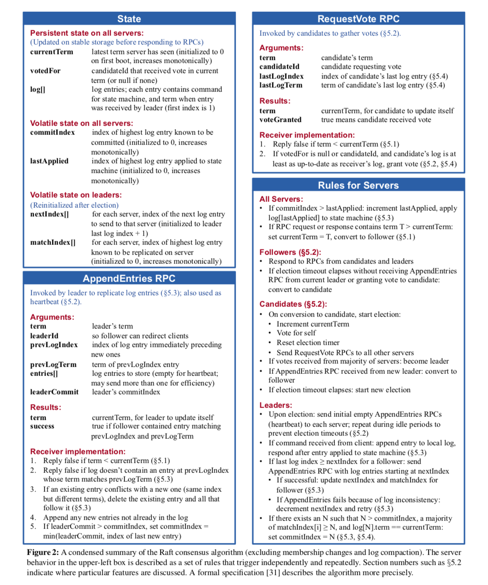

# 总体概览
lab2 的内容是要实现一个除了节点变更功能外的 raft 算法，还是比较有趣的。
它被划分成了Lab2A、Lab2B、Lab2C和Lab2D四个子任务：

1. Lab2A：实现 leader election、heartbeat。
2. Lab2B：实现 Log replication。
3. Lab2C：实现 state persistent。
4. Lab2D：实现 SnapShot


有关 go 实现 raft 的种种坑，可以首先参考 6.824 课程对[locking](https://pdos.csail.mit.edu/6.824/labs/raft-locking.txt) 和 [structure](https://pdos.csail.mit.edu/6.824/labs/raft-structure.txt) 的描述，然后再参考 6.824 TA 的 [guidance](https://thesquareplanet.com/blog/students-guide-to-raft/) 。写之前一定要看看这三篇博客，否则很容易被 bug 包围。

实现Raft的时候基本就盯着Figure2的图片即可：


## 关于 LogIndex
raft 关于一致性最重要的就是 peers 之间各种 Index 的同步。但需要注意的一点是：**logEntry 的 Index 是从 1 开始的**，而不同与log[]的数组下标。在完成 D Snapshot时，需要在数据中截断Index小于SnapShotIndex的Entry，而只保留Index大于的Entry在log[]数组中，因此，我们要正确区分 EntryIndex (包括figure2中提及的所有Index)和 ArrayIndex (用作下表去取log[]中的Entry）。因此关于 Log数组中下标为0的位置，我拿来作为个 dummy node,用于lab4D中的 lastSnapShotIndex 和 lastSnapShotTerm，这样后续的代码会有一定的简便性。


下面会简单介绍我实现的 raft。

# lab2B

相比较Lab2A的选主来说，Lab2B则集中精力在 appendEntriesRPC 部分，坑明显变多。

AppendEntries 对于A的修改就比较大了，最主要的就是要判断以下几件事：

- leader对于自己的同步状态是否准确
- 自己的log是否与leader冲突
- 从leader得知commit进度

这里建议再仔细阅读论文关于 appendEntries 规则，并充分理解作者如何设计使得 raft 达到其 safe gurantee 。还有一个值得注意的是，再论文第7页末尾提到了一个”Conflict Index Optimiszation“ 这个再figuer2中并没有出现，但建议这里直接实现，否则实验 D 中 SnapShot 时会发生大量重传，不能达到测试时间限制。

这里最重要的就是充分考虑 args.PrevLogIndex, len(rf.log)的关系，考虑在各种情况下，follower应该返回给leader什么样的信息来完成二者的高效协作同步。

## 总体架构
我相对于 lab2A,把日志放在心跳中去，且再次模块化了一下代码：

启动阶段：

```go
func Make(peers []*labrpc.ClientEnd, me int,
	persister *Persister, applyCh chan ApplyMsg) *Raft {
	rf := &Raft{
		peers:     peers,
		persister: persister,
		me:        me,
		applyCh:   applyCh,
	}

	// Your initialization code here (2A, 2B, 2C).
	rf.init()

	// initialize from state persisted before a crash
	rf.readPersist(persister.ReadRaftState())

	// start ticker goroutine to start elections
	go rf.ticker()
	go rf.applyLog()

	return rf
}

func (rf *Raft) ticker() {
	for rf.killed() == false {
		// Your code here to check if a leader election should
		// be started and to randomize sleeping time using
		// time.Sleep().
		rf.mu.Lock()
		switch rf.status {
		case follower:
			if rf.electionTimeout() {
				rf.TurnTo(candidate)
				rf.doElection()
				rf.resetElectionTime()
			}
		case candidate:
			if rf.electionTimeout() {
				rf.TurnTo(candidate)
				rf.doElection()
				rf.resetElectionTime()
			}
		case leader:
			if rf.heartbeatTimeout() {
				rf.doAppendEntries()
				rf.resetHeartbeatTime()
			}
		}
		rf.mu.Unlock()
		time.Sleep(time.Duration(gap_time) * time.Millisecond)
	}
}

func (rf *Raft) applyLog() {
	for rf.killed() == false {
		rf.mu.Lock()
		for rf.lastApplied >= rf.commitIndex {
			rf.applyCond.Wait()
		}
		commitIndex := rf.commitIndex
		commit := rf.commitIndex
		applied := rf.lastApplied
		entries := make([]Entry, commit-applied)
		copy(entries, rf.log[applied+1:commit+1])
		rf.mu.Unlock()

		for _, entry := range entries {
			rf.applyCh <- ApplyMsg{
				CommandValid: true,
				Command:      entry.Cmd,
				CommandIndex: entry.Index,
				CommandTerm:  entry.Term,
			}
		}

		rf.mu.Lock()
		if commitIndex > rf.lastApplied {
			rf.lastApplied = commitIndex
		}
		rf.mu.Unlock()
	}
}
```
# AppendEntries

```go
func (rf *Raft) doAppendEntries() {
	for i := 0; i < len(rf.peers); i++ {
		if i == rf.me {
			continue
		}
		go rf.appendTo(i)
	}
}

func (rf *Raft) appendTo(peer int) {
	rf.mu.Lock()
    //只有 Leader 能发心跳
	if rf.status != leader {
		rf.mu.Unlock()
		return
	}
	args := AppendEntriesArgs{
		Term:         rf.currentTerm,
		LeaderId:     rf.me,
		PrevLogIndex: magic_index,
		PrevLogTerm:  magic_term,
		LeaderCommit: rf.commitIndex,
	}

	prevLogIndex := rf.nextIndex[peer] - 1
	idx := prevLogIndex

	args.PrevLogIndex = rf.log[idx].Index
	args.PrevLogTerm = rf.log[idx].Term

	// must copy in here
	entries := rf.log[idx+1:]
	args.Entries = make([]Entry, len(entries))
	copy(args.Entries, entries)
	rf.mu.Unlock()

	reply := AppendEntriesReply{}

	ok := rf.sendAppendEntries(peer, &args, &reply)
	if !ok {
		return
	}

	rf.mu.Lock()
	defer rf.mu.Unlock()

	// 如果状态改变了，不是 Leader 了就退出
	if rf.currentTerm != args.Term || rf.status != leader || reply.Term < rf.currentTerm {
		// overdue, ignore
		DPrintf("S%d old response from C%d, ignore it", rf.me, peer)
		return
	}

	// If RPC request or response contains term T > currentTerm:
	// set currentTerm = T, convert to follower (§5.1)
	if reply.Term > rf.currentTerm {
		rf.currentTerm, rf.votedFor = reply.Term, voted_nil
		rf.persist()
		rf.TurnTo(follower)
		return
	}
    //同步成功，更新下标
	if reply.Success {
		rf.nextIndex[peer] = args.PrevLogIndex + len(args.Entries) + 1
		rf.matchIndex[peer] = args.PrevLogIndex + len(args.Entries)
		rf.toCommit()
		return
	}
    // 冲突情况，看 lecture，老师有讲
	if reply.XTerm == -1 { // null slot
		rf.nextIndex[peer] -= reply.XLen
	} else if reply.XTerm >= 0 {
		termNotExit := true
		for index := rf.nextIndex[peer] - 1; index >= 1; index-- {
			entry, err := rf.getEntry(index)
			if err < 0 {
				continue
			}

			if entry.Term > reply.XTerm {
				continue
			}

			if entry.Term == reply.XTerm {
				rf.nextIndex[peer] = index + 1
				termNotExit = false
				break
			}
			if entry.Term < reply.XTerm {
				break
			}
		}
		if termNotExit {
			rf.nextIndex[peer] = reply.XIndex
		}
	} else {
		rf.nextIndex[peer] = reply.XIndex
	}
	// the smallest nextIndex is 1
	// otherwise, it will cause out of range error
	if rf.nextIndex[peer] < 1 {
		rf.nextIndex[peer] = 1
	}
}

// handler need to require lock
func (rf *Raft) AppendEntries(args *AppendEntriesArgs, reply *AppendEntriesReply) {
	rf.mu.Lock()
	defer rf.mu.Unlock()
	defer rf.persist()

	if args.Term < rf.currentTerm { // leader out, refuse
		reply.Term = rf.currentTerm
		reply.Success = false
		return
	}

	if args.Term > rf.currentTerm {
		// If RPC request or response contains term T > currentTerm:
		// set currentTerm = T, convert to follower (§5.1)
		rf.currentTerm, rf.votedFor = args.Term, voted_nil
		DPrintf("S%d S%d term larger(%d > %d)", rf.me, args.LeaderId, args.Term, rf.currentTerm)
		rf.TurnTo(follower)
	}

	reply.Success = true
	reply.Term = rf.currentTerm
	//  prevent election timeouts (§5.2)
	rf.resetElectionTime()

	//日志断层    
    // 冲突情况，看 lecture，老师有讲
	if args.PrevLogIndex > rf.lastLogIndex() {
		reply.Success = false
		reply.XTerm = -1
		reply.XLen = args.PrevLogIndex - rf.lastLogIndex()
		return
	}

	idx := args.PrevLogIndex

	if rf.log[idx].Term != args.PrevLogTerm {
		reply.Success = false
		reply.XTerm = rf.log[idx].Term
		reply.XIndex = args.PrevLogIndex
		// 0 is a dummy entry => quit in index is 1
		for index := idx; index >= 1; index-- {
			if rf.log[index-1].Term != reply.XTerm {
				reply.XIndex = index
				break
			}
		}
		return
	}

	if args.Entries != nil && len(args.Entries) != 0 {
        //冲突就覆盖
		if rf.isConflict(args) {
			rf.log = rf.log[:idx+1]
			entries := args.Entries
			rf.log = append(rf.log, entries...)
		} else {
			// DPrintf("S%d no conflict, log: %+v", rf.me, rf.log)
		}
	} else {
		DPrintf("S%d args entries nil or length is 0: %v", rf.me, args.Entries)
	}

    //更新 commitIndex
	if args.LeaderCommit > rf.commitIndex {
		rf.commitIndex = args.LeaderCommit
		if args.LeaderCommit > rf.lastLogIndex() {
			rf.commitIndex = rf.lastLogIndex()
		}
        //可以应用 log 了
		rf.applyCond.Signal()
	}
}

```

# 总结Lab2B
- nextIndex 是 leader 对 follower 日志同步进度的猜测，matchIndex 则是实际获知到的同步进度，leader 需要不断的 appendEntries 来和 follower 进行反复校对。
- Leader 更新 commitIndex 需要计算大多数节点拥有的日志范围，通过对 matchIndex 排序找中位数的 index ，就是大多数节点都拥有的日志范围，将其设置为 commitIndex 。
- Follower 收到 appendEntries 时，一定要在处理完 log 写入后再更新 commitIndex，因为论文中要求 Follower 的 commitIndex 是min(local log index，leaderCommitIndex)。
- Leader 在不断调整某个 follower 的 nextIndex 过程中，注意不要让 nextIndex 减小到1以下，因为 nextIndex 的语义是 follower 的下一个日志写入下标。
- requestVote 接收端，一定要严格根据论文判定发起方的 lastLogIndex 和 lastLogTerm 是否符合条件，这里很容易写错。
- appendEntries 接收端，一定要严格遵从 prevLogIndex 和 prevLogTerm 的论文校验逻辑，首先看一下prevLogIndex处是否有本地日志（prevLogIndex==0除外，相当于从头同步日志），没有的话则还需要leader来继续回退 nextIndex 直到 prevLogIndex 位置有日志。在 prevLogIndex 有日志的前提下，还需要进一步判断prevLogIndex位置的Term是否一样。
- appendEntries 接收端返回 success=true 的前提必须是将 leader 传来的日志处理完了并且更新了commitIndex 之后。
- appendEntries 接收端，要做好日志冲突时的后续全部截断逻辑。
- 注意当log、voteFor、commitIndex三个状态变化后，返回RPC前一定要 persist() 持久化一下（Lab2B并不要求 persist ，但是 Lab3C 要求，所以在这里先做好，免得Lab2C回头加）
- 日志提交通过一个独立的 goroutine 实现就行，定期判断lastApplied和commitIndex之间的有日志就提交即可，注意提交效率（copy出来释放掉锁，然后往应用层推）
