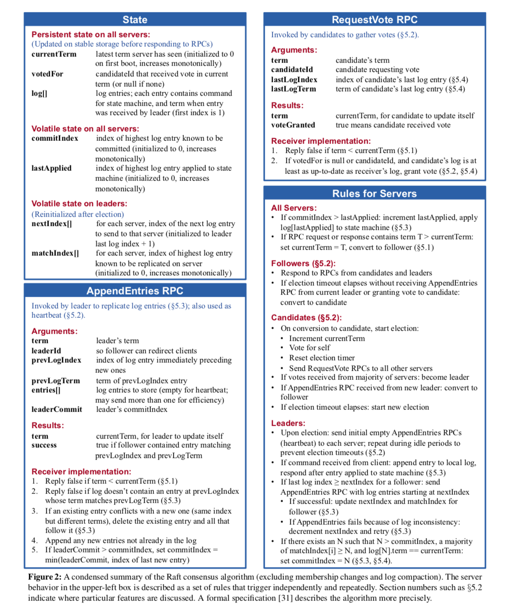

# 总体概览
lab2 的内容是要实现一个除了节点变更功能外的 raft 算法，还是比较有趣的。
它被划分成了Lab2A、Lab2B、Lab2C和Lab2D四个子任务：

1. Lab2A：实现 leader election、heartbeat。
2. Lab2B：实现 Log replication。
3. Lab2C：实现 state persistent。
4. Lab2D：实现 SnapShot


有关 go 实现 raft 的种种坑，可以首先参考 6.824 课程对[locking](https://pdos.csail.mit.edu/6.824/labs/raft-locking.txt) 和 [structure](https://pdos.csail.mit.edu/6.824/labs/raft-structure.txt) 的描述，然后再参考 6.824 TA 的 [guidance](https://thesquareplanet.com/blog/students-guide-to-raft/) 。写之前一定要看看这三篇博客，否则很容易被 bug 包围。

实现Raft的时候基本就盯着Figure2的图片即可：


## 关于 LogIndex
raft 关于一致性最重要的就是 peers 之间各种 Index 的同步。但需要注意的一点是：**logEntry 的 Index 是从 1 开始的**，而不同与log[]的数组下标。在完成 D Snapshot时，需要在数据中截断Index小于SnapShotIndex的Entry，而只保留Index大于的Entry在log[]数组中，因此，我们要正确区分 EntryIndex (包括figure2中提及的所有Index)和 ArrayIndex (用作下表去取log[]中的Entry）。因此关于 Log数组中下标为0的位置，我拿来作为个 dummy node,用于lab4D中的 lastSnapShotIndex 和 lastSnapShotTerm，这样后续的代码会有一定的简便性。


# labC
Lab2C主要是当 currentTerm、voteFor、log[ ] 更新后，调用persister将它们持久化下来，因为这3个状态是要求持久化的。

- 这里要求我们阅读理解 persiter.go，并完成 readpersist 和 persist 函数,这两段代码基本骨架都在了，我们只需要理解它就可以。可以简单理解成一个 persist 编码，readpersist 解码的过程。
在每一次任何一个需要持久化的量发生改变时触发 persist , 在 peers Init or Recover 时调用 readpersist 即可。
- 基本 C 实验本身不会造成错误，但测试C中有复杂的网络随机性变化情况，没有通过测试的原因可能仍然出现在你的 LeaderElection 和 AppendEntries上。

```go

//
// save Raft's persistent state to stable storage,
// where it can later be retrieved after a crash and restart.
// see paper's Figure 2 for a description of what should be persistent.
//
func (rf *Raft) persist() {
	// Your code here (2C).
	rf.persister.SaveRaftState(rf.raftState())
}
func (ps *Persister) SaveRaftState(state []byte) {
	ps.mu.Lock()
	defer ps.mu.Unlock()
	ps.raftstate = clone(state)
}
func (rf *Raft) raftState() []byte {
	w := new(bytes.Buffer)
	e := labgob.NewEncoder(w)

	if e.Encode(rf.log) != nil ||
		e.Encode(rf.currentTerm) != nil ||
		e.Encode(rf.votedFor) != nil {
		DPrintf("S%d encode fail", rf.me)
		panic("encode fail")
	}
	data := w.Bytes()
	return data
}
//
// restore previously persisted state.
//
func (rf *Raft) readPersist(data []byte) {
	if data == nil || len(data) < 1 { // bootstrap without any state?
		return
	}
	// Your code here (2C).
	r := bytes.NewBuffer(data)
	d := labgob.NewDecoder(r)

	var log []Entry
	var currentTerm, votedFor int

	if d.Decode(&log) != nil ||
		d.Decode(&currentTerm) != nil ||
		d.Decode(&votedFor) != nil {
		DPrintf("S%d decode fail", rf.me)
		panic("encode fail")
	}

	// log at least is 1
	rf.log = make([]Entry, len(log))
	copy(rf.log, log)
	rf.lastApplied = 0
	rf.commitIndex = 0
	rf.currentTerm = currentTerm
	rf.votedFor = votedFor
}
```

# labC 总结

lab2C只是在lab2B基础上，把持久化状态进行了 persist 存储，另外对日志同步性能提出了更高要求，因为它会制造网络分区形成2个leader然后向2个 leader 同时写入大量日志，造成2个很长的歧义日志，然而默认的论文实现每次回退1个下标进行重试是无法通过单测的，好在我们在 lab2B 就实现了碰撞机制来快速恢复。

- 快速恢复原理：参考这里https://mit-public-courses-cn-translatio.gitbook.io/mit6-824/lecture-07-raft2/7.3-hui-fu-jia-su-backup-acceleration
- leader 可能收到旧的 appendEntries RPC 应答，因此 leader 收到 RPC 应答时重新加锁后，应该注意检查 currentTerm 是否和 RPC 时的 term 一样，另外也不应该对 nextIndex 直接做 -=1 这样的相对计算（因为旧 RPC 应答之前可能新 RPC 已经应答并且修改了 nextIndex ），而是应该用RPC时的prevLogIndex等信息做绝对计算，这样是不会有问题的。