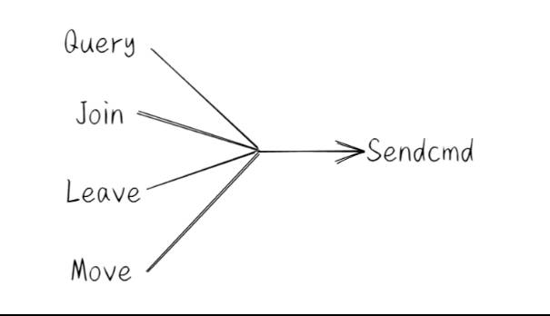

# 整体架构


- 在这个实验中，我们要创建一个 “分布式的，拥有分片功能的，能够加入退出成员的，能够根据配置同步迁移数据的，Key-Value数据库服务”。
- 在Lab4A中，我们需要构造 ShardCtrler , 运行时，多个 ShardCtrler Servers 组成一个Raft管理的集群，这个集群共同维护了一个数组 []Config。**一个Config即代表测试者对整个服务集群的一次“最新配置指令”。Config的具体理解见图中**。同时，通过shardctrler/client 提供了一个可以Query这个集群Config信息的接口，因此，用户以及后续的 ShardKVCluster 都可以通过这个接口来获取集群最新的Config信息。
- Lab4B则要求我们实现 分片的 KeyValue 服务。系统规定分片数量为 NShards = 10.我们将要构建多个 ShardKV Cluster (也就是一个用gid来区别的Group)， 每个 Group 负责几个分片（至少一个）。
- 每个 Group 负责的分片会根据 Config 信息的不同而变化。因此，在有新的Config之后，这些Group需要根据他在彼此间进行互相迁移。迁移过程中相应分片无法对外提供服务。
- **而客户端根据hash函数得到要操作的 KEY 属于的 Shard**， 在去查询 Config 信息，又能得到这个 Shard 属于哪个Group在负责。然后去相应的 Group Raft Leader 处请求操作数据即可。

# Lab4A概览
**有关 shardctrler，其实它就是一个高可用的集群配置管理服务。**
- 这里要我们实现集群的”配置管理服务“的部分。首先我们先理解几个操作的含义：
    - Join : 新加入的Group。
    - Leave : 哪些Group要离开。
    - Move : 将Shard分配给指定 GID 的 Group ,无论它原来在哪。
    - Query : 查询最新的Config信息。
- 其实，这里就能看出来，它非常像我们实现过的Lab3. Join, Leave, Move 其实就是 Put, Append, Query就是Get. 因此，我们只需要在Lab3的代码逻辑上修改就可以了。主要修改的就是：
    - 替换几大操作。
    - 在Join, Leave之后，需要根据分片分布情况进行负载均衡（reBalance).其实就是让每个集群负责的分片数量大致相同，并且进行尽量少的数据迁移。
    - 一些细节。
- 余下的，一些像 ”重复命令检测“之类的完全不少。因此，我们先把lab3B的代码copy过来即可。仅通过lab4A的测试来看，不需要实现snapshot。

## Client
添加 ClientId, requestId 来检测 duplicate ，和上一次成功访问呢的 LeaderId ，进行访问优化。结构代码为：
```GO
type Clerk struct {
	servers []*labrpc.ClientEnd
	// Your data here.
	leaderId int
	clientId int64
	seqId    int64
}
```
同时为了代码复用性，采用了代码上的多路复用:


四个路口最后走的是一个通道，这里贴出Sendcmd的代码：
```GO
func (ck *Clerk) sendCmd(args CommandArgs) CommandReply {
	ck.seqId += 1
	args.SeqId = ck.seqId
	args.ClientId = ck.clientId

	for {
		reply := CommandReply{}
		//这里的 ok 指的是 Rpc是否调用成功
		ok := ck.servers[ck.leaderId].Call("ShardCtrler.Command", &args, &reply)
		//如果该 Server 无法响应 RPC 则换一个
		if !ok {
			ck.leaderId = (ck.leaderId + 1) % len(ck.servers)
			time.Sleep(retry_timeout)
			continue
		}

		if reply.Err == OK {
			return reply
		}
        //如果该 Server 不是 Leader 则休息一下换下一个 Server
		ck.leaderId = (ck.leaderId + 1) % len(ck.servers)
		time.Sleep(retry_timeout)
	}
}
```
Client 的整体结构很简单，大概就是这样。

## Server
- Server收到Client请求后交付 Raft 并指定 Channel 等待结果，Raft 持续 Apply Command，并执行响应操作及去重等行为，再将结果返回给 Wati Channel, 从而返回给用户。
- 指定 Wait Channel 的同时需要设置超时机制。
- Join & Leave之后需要 ReBalance Shards[ ].

结构如下：

```GO
type ShardCtrler struct {
	mu      sync.Mutex
	me      int
	rf      *raft.Raft
	applyCh chan raft.ApplyMsg
	dead    int32

	// Your data here.
	configs        *ConfigModel
	cmdRespChans   map[IndexAndTerm]chan OpResp
	LastCmdContext map[int64]OpContext // 上一次非幂等命令的结果
	lastApplied    int
}

type ConfigModel struct {
	configs []Config // indexed by config num
	me      int      // for debug
}

type Config struct {
	Num    int              // 配置版本号
	Shards [NShards]int     // shard -> gid
	Groups map[int][]string // gid -> servers[]
}

type OpContext struct {
	SeqId int64
	Reply OpResp
}
```
## 负载均衡（rebalance)

其实就是让每个集群负责的分片数量大致相同，并且进行尽量少的数据迁移。

emm，这里我采用的方法是：不断从拥有最多分片的 group 移走一个分片，到拥有最少分片的 group，直到，所有 group 中的分片数量的差距小于等于 1。至于被移走的那个分片，没啥特别讲究，我就移走相应 group 的第一个分片
```go
	//不断从持有数最多的那里那一个 shard 给持有数少的，直到所有 group 差距小于等于 1
	for {
		src := cm.getMaxShards(group2shard)
		dst := cm.getMinShards(group2shard)
		if src != magicNullGid && len(group2shard[src])-len(group2shard[dst]) <= 1 {
			break
		}

		group2shard[dst] = append(group2shard[dst], group2shard[src][0])
		group2shard[src] = group2shard[src][1:]
	}
```