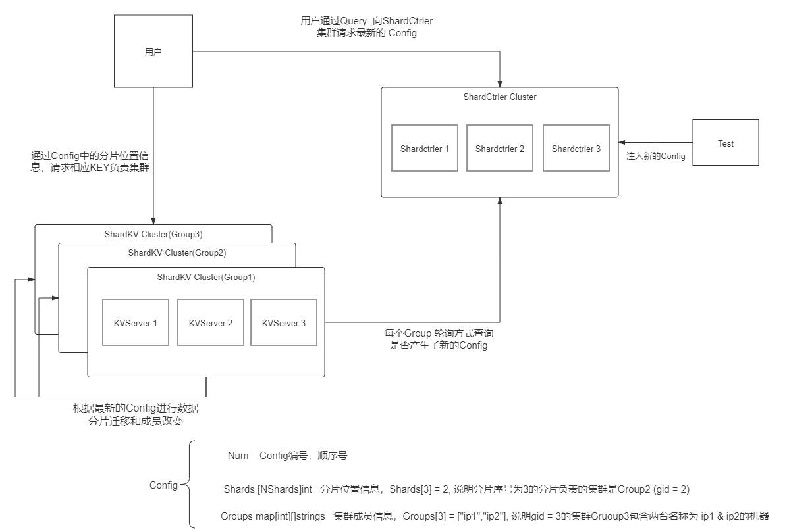

# 整体架构




- 在这个实验中，我们要创建一个 “分布式的，拥有分片功能的，能够加入退出成员的，能够根据配置同步迁移数据的，Key-Value数据库服务”。
- 在Lab4A中，我们需要构造 ShardCtrler , 运行时，多个 ShardCtrler Servers 组成一个Raft管理的集群，这个集群共同维护了一个数组 []Config。**一个Config即代表测试者对整个服务集群的一次“最新配置指令”。Config的具体理解见图中**。同时，通过shardctrler/client 提供了一个可以Query这个集群Config信息的接口，因此，用户以及后续的 ShardKVCluster 都可以通过这个接口来获取集群最新的Config信息。
- Lab4B则要求我们实现 分片的 KeyValue 服务。系统规定分片数量为 NShards = 10.我们将要构建多个 ShardKV Cluster (也就是一个用gid来区别的Group)， 每个 Group 负责几个分片（至少一个）。
- 每个 Group 负责的分片会根据 Config 信息的不同而变化。因此，在有新的Config之后，这些Group需要根据他在彼此间进行互相迁移。迁移过程中相应分片无法对外提供服务。
- **而客户端根据hash函数得到要操作的 KEY 属于的 Shard**， 在去查询 Config 信息，又能得到这个 Shard 属于哪个Group在负责。然后去相应的 Group Raft Leader 处请求操作数据即可。

# Lab4B概览

有关 shardkv，其可以算是一个 multi-raft 的实现，只是缺少了物理节点的抽象概念。在实际的生产系统中，不同 raft 组的成员可能存在于一个物理节点上，而且一般情况下都是一个物理节点拥有一个状态机，不同 raft 组使用不同地命名空间或前缀来操作同一个状态机。

我们可以首先明确系统的运行方式：一开始系统会创建一个 shardctrler 组来负责配置更新，分片分配等任务，接着系统会创建多个 raft 组（Group）来承载所有分片的读写任务。此外，raft 组增删，节点宕机，节点重启，网络分区等各种情况都可能会出现。

对于集群内部，我们需要保证所有分片能够较为均匀的分配在所有 raft 组上，还需要能够支持动态迁移和容错。(**先前labA中只是配置上的动态迁移，即纸上谈兵，实际上分片还没迁移，这正是lab4B中我们要做的一个点**)

对于集群外部，我们需要向用户保证整个集群表现的像一个永远不会挂的单节点 KV 服务一样，即具有线性一致性。（**这里其实 Raft层 已经帮我们保证了**）

lab4B 的基本测试要求了上述属性，challenge1 要求及时清理不再属于本分片的数据，challenge2 不仅要求分片迁移时不影响未迁移分片的读写服务，还要求不同地分片数据能够独立迁移，即如果一个配置导致当前 raft 组需要向其他两个 raft 组拉取数据时，一个拉取成功了，另一个拉取失败了，不能影响拉取成功的部分提供服务。

## Client
为了Server Duplication detection , 提供ClientId, requestId,这里不再详述，这里官方提供 config 是为了找到分片，因此更新 config 也需要我们找时间做 。先展示一下结构：
```go
type Clerk struct {
	sm       *shardctrler.Clerk
	config   shardctrler.Config
	make_end func(string) *labrpc.ClientEnd //该函数为了让我们根据 server 名字找到目标节点
	// You will have to modify this struct.
	seqId    int64
	clientId int64
}
```
类似于 lab4A的代码多路复用


这里贴出 SendCommand 的方法
```go
func (ck *Clerk) sendCmd(key string, value string, OpType OPType) string {
	ck.seqId += 1
	args := CmdArgs{
		SeqId:    ck.seqId,
		ClientId: ck.clientId,
		Key:      key,
		Value:    value,
		OpType:   OpType,
	}

	t0 := time.Now()
	for time.Since(t0).Seconds() < 15 {
        //找到该 key 所在的切片
		shard := key2shard(key)
        //找到该切片所在的 Group
		gid := ck.config.Shards[shard]
        //轮询该 Group 成员， 找到该 Raft 组中的 Leader
		if servers, ok := ck.config.Groups[gid]; ok {
			// try each server for the shard.
			for si := 0; si < len(servers); si++ {
				srv := ck.make_end(servers[si])
				var reply CmdReply
				ok := srv.Call("ShardKV.Command", &args, &reply)
				if ok && (reply.Err == OK || reply.Err == ErrNoKey) {
					return reply.Value
				}
				if ok && (reply.Err == ErrWrongGroup) {
					break
				}
				// ... not ok, or ErrWrongLeader
			}
		}
		time.Sleep(100 * time.Millisecond)
		// 跳出来说明该切片不在该Group，说明配置变更，主动要求更新配置
		ck.config = ck.sm.Query(-1)
	}

	return ""
}
```

## Server

- Server 收到 Client 请求后交付 Raft 并指定 Channel 等待结果，Raft 持续 Apply Command ，并执行响应操作及去重等行为，再将结果返回给 Wati Channel, 从而返回给用户。此外还需进行 snapshot。
- 指定 Wait Channel 的同时需要设置超时机制。
- 我为了实现lab4B的要求，对 Server 另外起了3个线程，分别执行：更新配置，迁移切片，清理切片。
  - **清理切片线程主要是为了完成challenge2**，在这里我提供了一个中间状态——Gcing，迁移过来的切片，在收到后，首先是 Gcing 状态，然后**清理切片线程**，每隔一段时间，会对所有处于 Gcing 的切片进行状态更新：将 处于 Gcing 状态 的切片转换为 Serving，代表迁移完成并正式提供服务，同时为了清理资源，会发送 Rpc ,删除发送端的该切片，有迁入，一般也会有迁出，对于发送端，**收到 RPC 则会将所有处于 BePulling 的切片回收清理**。
  - 更新配置线程则是每隔一段时间，便向 shardctrler 寻求最新配置，这里要注意的是，**当存在切片在迁移时，则不能更新配置**，要等目前配置状态结束才能继续进去，以免引起不可描述的状态。同时在拉取到最新配置时，只需要更新每个分片所处于的状态：**将新加入的分片状态设为 Pulling,将被迁走的分片设为 BePulling 然后就可以等迁移分片线程和清理切片线程来处理后续**。
  - 迁移分片线程，则是每隔一段时间，扫描分片状态，对于处于 Pulling 状态的分片 , 将向根据旧配置该分片所处于 Group，索要该分片，索要成功后，则将该分片设为 Gcing。 

他们之间的关系大致为：


且该三个线程只能由 Leader 进行执行，由此来让 Raft层 对线性一致性进行保障。且我采用的是回调函数形式，将三个功能分别交给一个 monitor进行执行。下面来看代码

- monitor代码
```go
func (kv *ShardKV) monitor(action func(), timeout time.Duration) {
	for !kv.killed() {
        //只有 leader 才能执行
		if _, isLeader := kv.rf.GetState(); isLeader {
			action()
		}
		time.Sleep(timeout)
	}
}
```

- 更新配置代码

```go
func (kv *ShardKV) configureAction() {
	canPerformNextConfig := true
	kv.mu.Lock()
	//若有一个分片正在迁移，则不能采取新配置
	for _, shard := range kv.shards {
		if shard.Status != Serving {
			Debug(dWarn, "G%+v S%d shard: %+v", kv.gid, kv.me, shard)
			canPerformNextConfig = false
			break
		}
	}
	//执行大于当前配置版本一代的配置
	currentConfigNum := kv.currentConfig.Num
	kv.mu.Unlock()
	if canPerformNextConfig {
		nextConfig := kv.sc.Query(currentConfigNum + 1)
		if nextConfig.Num == currentConfigNum+1 {
            // 该函数，将改变状态的部分交给 Raft 层进行操作，以保障一致性，即以 log 的形式
			kv.Execute(NewConfigurationCommand(&nextConfig), &OpResp{})
		}
	} else {
		Debug(dWarn, "G%+v {S%+v} don't need fetch config!", kv.gid, kv.me)
	}
}

```
- 迁移分片代码
```GO
func (kv *ShardKV) migrationAction() {
	kv.mu.Lock()
	//寻找需要迁移过来的分片
	gid2shardIDs := kv.getShardIDsByStatus(Pulling, &kv.lastConfig)
	if len(gid2shardIDs) == 0 {
		kv.mu.Unlock()
		return
	}
	var wg sync.WaitGroup
	//得到需要迁移过来的分片所在 group
	for gid, shardIDs := range gid2shardIDs {
		wg.Add(1)
		//取出持有该分片的所有 server
		servers := kv.lastConfig.Groups[gid]
		go func(servers []string, configNum int, shardIDs []int) {
			defer wg.Done()
			//拿着现在的 config 编号和需要的分片 ID 去索要
			args := PullDataArgs{
				ConfNum:  configNum,
				ShardIds: shardIDs,
			}
            //当然只有那个 group 中的 leader能回答你
			for _, server := range servers {
				var resp PullDataReply
				srv := kv.makeEnd(server)
				if srv.Call("ShardKV.GetShardsData", &args, &resp) && resp.Err == OK {
					kv.Execute(NewInsertShardsCommand(&resp), &OpResp{})
				}
			}
		}(servers, kv.currentConfig.Num, shardIDs)
	}
	kv.mu.Unlock()
	Debug(dServer, "G%+v {S%+v} migrationAction wait", kv.gid, kv.me)
	wg.Wait()
	Debug(dServer, "G%+v {S%+v} migrationAction done", kv.gid, kv.me)
}
```

- 清理分片代码
```go
func (kv *ShardKV) gcAction() {
	kv.mu.Lock()
	//得到所有成功迁移过来的分片ID
	gid2shardIDs := kv.getShardIDsByStatus(GCing, &kv.lastConfig)
	var wg sync.WaitGroup
	//得到需要清理的分片所在 group，即发送方
	for gid, shardIDs := range gid2shardIDs {
		wg.Add(1)
		servers := kv.lastConfig.Groups[gid]
		go func(servers []string, configNum int, shardIDs []int) {
			defer wg.Done()
            //当前的配置号和要清理的分片组
			args := PullDataArgs{configNum, shardIDs}
			for _, server := range servers {
				var reply PullDataReply
				srv := kv.makeEnd(server)
                //帮该分片的原 server 和自己 清理/更新 一下该组分片，当然这种改变状态的，只能请求对方 Leader
				if srv.Call("ShardKV.DeleteShardsData", &args, &reply) && reply.Err == OK {
					kv.Execute(NewDeleteShardsCommand(&args), &OpResp{})
				}
			}
		}(servers, kv.currentConfig.Num, shardIDs)
	}
	kv.mu.Unlock()
	wg.Wait()
}
```

作为数据库的功能处理也和上面类似：
```go
func (kv *ShardKV) applyOperation(msg *raft.ApplyMsg, cmd *CmdArgs) *OpResp {
    //得到 key 所在的分片id
	shardID := key2shard(cmd.Key)
    // Gcing 和 Servering 都可提供服务
	if kv.canServe(shardID) {
		if cmd.OpType != OpGet && kv.isDuplicate(shardID, cmd.ClientId, cmd.SeqId) {
            //非幂等请求且重复了，直接返回该客户端的上一个请求的回答就好了
			context := kv.shards[shardID].LastCmdContext[cmd.ClientId]
			return &context.Reply
		} else {
			var resp OpResp
            //进行命令处理
			resp.Value, resp.Err = kv.Opt(cmd, shardID)
			kv.shards[shardID].LastCmdContext[cmd.ClientId] = OpContext{
				SeqId: cmd.SeqId,
				Reply: resp,
			}
			return &resp
		}
	}
	return &OpResp{ErrWrongGroup, ""}
}
```